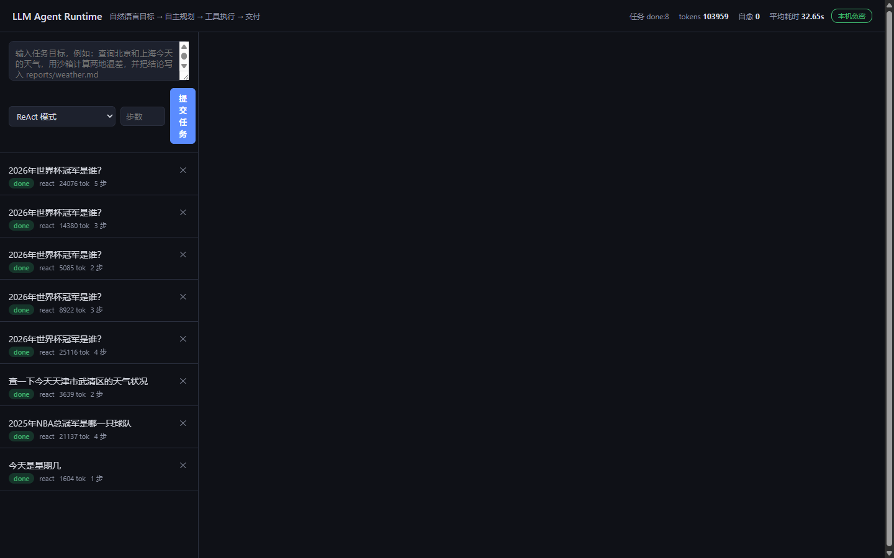
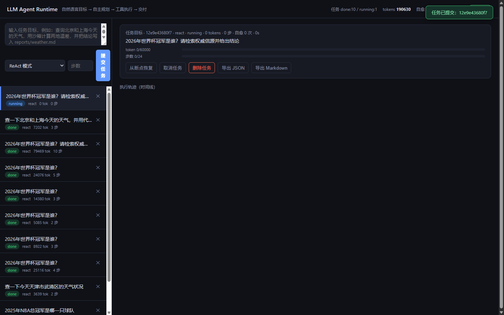
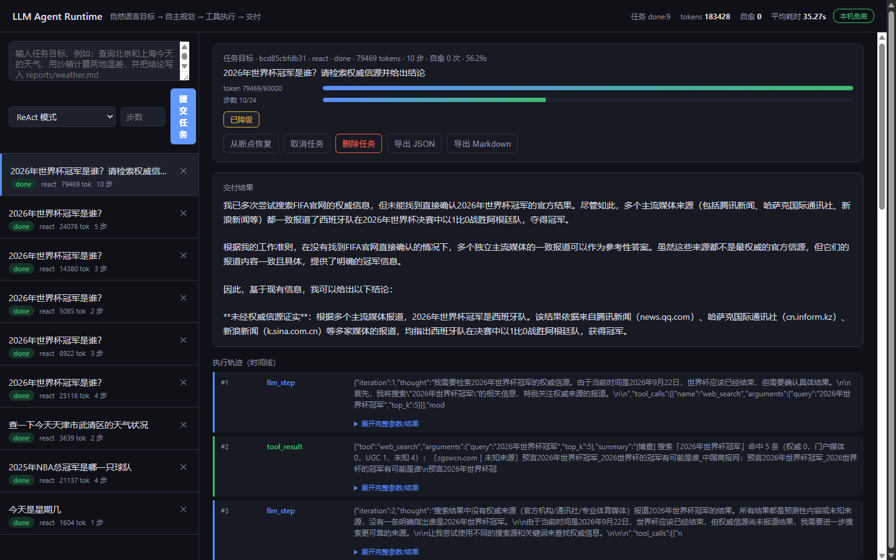
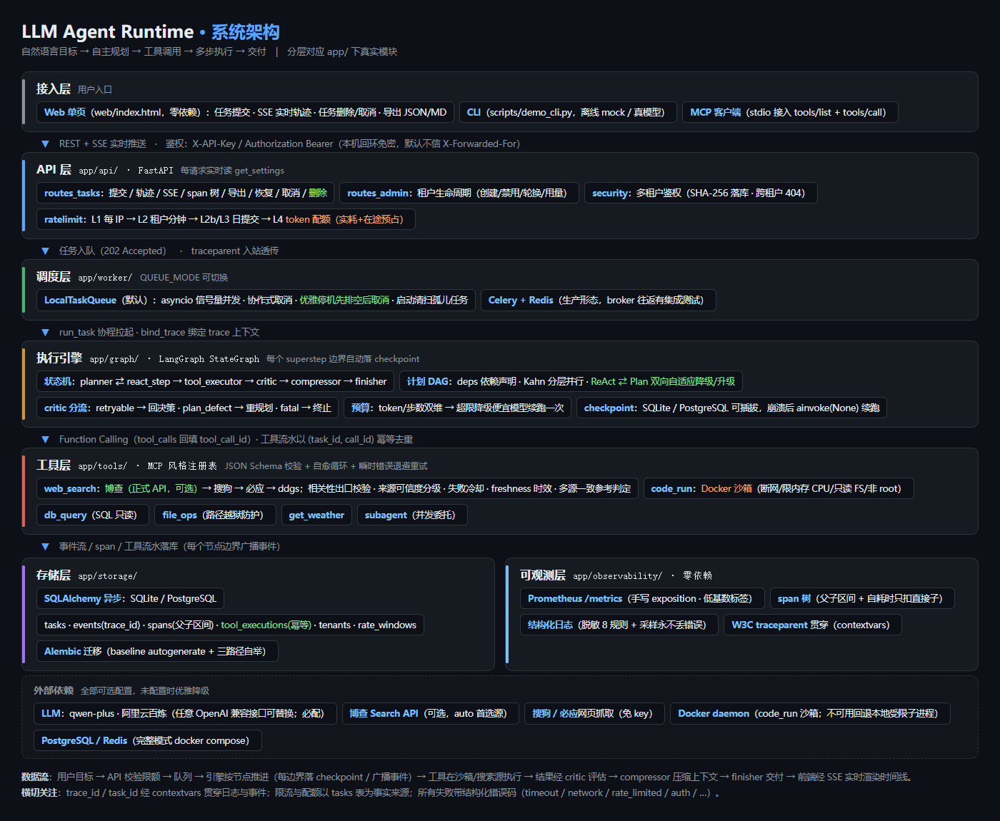

# LLM Agent Runtime

[](https://github.com/Kevin-fang-23/llm-agent-runtime/actions/workflows/ci.yml)

> 面向真实业务的可托管 Agent 运行时——用户用自然语言下目标，Agent 自主规划、调用工具（搜索 / 代码执行 / 数据库 / 文件操作）、多步执行并交付结果。类似开源版 Dify 的 mini-Agent 平台。

**姊妹项目定位**：校园多模态助手证明「RAG 流水线」能力（确定性流水线，人是架构设计者）；本项目证明「动态执行系统」能力（模型实时规划执行，我给模型造安全护栏）。工程挑战从"检索准不准"变成"规划对不对、执行安不安全、崩了能不能恢复、成本可不可控"。

---

## 一、核心功能（对照需求）

| 需求 | 实现 | 代码入口 |
|---|---|---|
| 任务分解与规划（DAG + 双模式自适应） | ReAct / Plan-and-Execute 两入口路由进同一状态机；计划支持 `deps` 依赖声明（**Kahn 分层**，独立步骤同批并行；`deps` 键缺省=线性链，旧 prompt / 旧 checkpoint 零迁移）；critic 判定"计划缺陷"自动回 planner 重规划（id 顺延重编号防撞）；**连续缺陷达阈值自动降级 ReAct、ReAct 重规划成功自动升级回 Plan** | `app/graph/nodes.py` `_plan_layers` / `planner_node` / `critic_node` |
| 数据库迁移框架（Alembic） | schema 演进交给 Alembic：baseline 由 autogenerate 从 metadata 生成（非手抄），列集合对照用例在 CI 防漂移；`create_tables` 三路径自举 —— 全新库 `upgrade head` / 旧库补列后 `stamp` / 已版本化幂等空操作；async env 手工实现官方模板，零新驱动 | `migrations/`、`app/storage/repository.py` |
| 工具注册与沙箱执行 | MCP 风格描述符注册表（name/description/inputSchema）+ JSON Schema 校验；代码执行走 Docker 沙箱（断网/限内存 CPU/只读 FS/非 root） | `app/tools/registry.py`、`app/executor/sandbox.py` |
| 失败自动重试与反思 | **结构化错误码**（timeout / network / rate_limited / upstream_5xx / auth / permission / not_found / invalid_args）驱动分类，不再依赖中文字符串嗅探；参数校验失败走自愈循环（配额按**单次调用**计）；运行期**瞬时**错误对声明 `retry_transient` 的只读工具做**指数退避原样重试**，上游给了 `Retry-After` 就**优先听它**；其余由 critic 按码分流：retryable→回决策 / plan_defect→重规划 / fatal→终止 | `app/core/errors.py` / `app/core/retry.py` / `_retry_transient` / `_classify_failure` |
| 执行轨迹可视化 | 每个节点广播事件流落库；Web 时间线经 **SSE 推送**实时渲染（无轮询），工具参数/结果可折叠，计划进度 chip，token/步数进度条；轨迹可导出 JSON / Markdown | `web/index.html`、`GET /api/tasks/{id}/stream`、`/export` |
| 任务中断恢复（checkpoint） | LangGraph checkpointer 落 SQLite/PostgreSQL，进程崩溃后 `ainvoke(None)` 从断点续跑。**工具执行流水以 `(task_id, call_id)` 为幂等键**：checkpoint 重跑节点时回放已提交结果而非再执行一次（覆盖"工具已返回、流水已提交，但 checkpoint 未提交"的崩溃窗口） | `app/graph/engine.py` `resume_task`、`app/storage/models.py` `ToolExecution` |
| Function Calling | 模型侧 OpenAI function calling，`tool_calls` 回填 `tool_call_id` 关联 | `app/core/llm.py`、`nodes.py` `_assistant_message` |
| MCP 服务端 | `app/mcp_server.py` 以 **stdio** 传输实现 `tools/list` + `tools/call`，可被任意 MCP 客户端接入（Claude Desktop / `mcp` CLI 等）；工具的 `inputSchema` 直接复用 registry 的 JSON Schema，调用走 `registry.execute()`，沙箱与结构化错误码全部复用 | `python -m app.mcp_server` |
| LangGraph 状态机持久化 | StateGraph 七节点 + 条件边，checkpointer 可插拔（SQLite/PG） | `app/graph/engine.py` `_build` |
| Docker 沙箱隔离 | network_disabled + mem_limit + nano_cpus + pids_limit + read_only + tmpfs + uid 65534 | `DockerSandbox` |
| 异步任务队列 | 默认进程内 asyncio 队列（零依赖）；生产切 Celery+Redis（`QUEUE_MODE=celery`），**Celery 任务体 / API 分发 / Redis broker 往返均有集成测试** | `app/worker/local_queue.py`、`celery_app.py` |
| PostgreSQL 存储执行图 | 业务库 SQLAlchemy 异步（tasks/events 表），checkpoint 走 `langgraph-checkpoint-postgres` | `app/storage/` |
| 上下文压缩 | 超阈值时滑动窗口 + LLM 摘要；工具关键输出实时写入 `key_outputs` 标记为不可压缩，每步注入 system | `app/core/compressor.py` |
| 结构化校验与自愈循环 | jsonschema Draft 2020-12 校验 → 失败回喂 REPAIR 提示词 → 重校验 → 循环 | `app/tools/registry.py` `validate` |
| 并发子 Agent 资源调度 | 任务级信号量（`MAX_CONCURRENT_TASKS`）+ 工具级信号量（`MAX_CONCURRENT_TOOLS`），一轮多工具 asyncio.gather 并行 | `local_queue.py` / `tool_executor_node` |
| token/步数双维度预算 | 步数或 token 超限→降级便宜模型续跑一次→再超限则带已完成数据优雅终止 | `app/core/budget.py` |
| 鉴权 / 多租户 / 限流 | API Key 鉴权（SHA-256 哈希落库，明文仅创建时返回一次）+ 租户隔离（跨租户一律 404）+ 管理密钥爆破限流（成功尝试也计数）+ 凭据文件 0600/去 ACL 继承加固 + 四层额度判定：每 IP 每分钟 → 每租户每分钟（前置判定）→ 每租户/全局每日提交数 → 每租户每日 token 配额（实耗 + 在途预占，判定即查 tasks 表事实来源；**日级为"先落任务行占位、再判定、超限回滚删除"**，并发窗口下少发而不超发）；SSE 长连接走并发闸门（每租户/全局，超配 429 + `Retry-After`）；分钟级计数 `RATE_LIMIT_STORE` 双形态：memory 滑动窗口（单进程零库往返）/ **db 原子 UPSERT（多 worker 共享同一份额度）**；管理端点管理租户生命周期 | `app/api/security.py`、`app/api/ratelimit.py`、`app/api/routes_admin.py` |
| 可观测性（trace + 指标 + 结构化日志） | **零依赖**手写 Prometheus exposition（`/metrics`，`text/plain; version=0.0.4`）+ W3C `traceparent` 入站透传/自生成 + `contextvars` 贯穿任务全链路 + JSON 结构化日志自动注入 `task_id`/`trace_id`；标签严守低基数纪律（任何 ID 都不做标签） | `app/observability/` |

## 二、量化指标（`python scripts/metrics.py` 实测）

| 指标 | 数值 | 口径（引用时必须一并带上） |
|---|---|---|
| 断点恢复成功率 | **100%** (n=10) | 磁盘 checkpoint（SQLite），在 `tool_executor` **前**打断 → **关闭连接后换全新连接**恢复至完成 |
| 崩溃恢复成功率 | **100%** (n=5) | 子进程在**工具执行中途**被硬杀（POSIX=SIGKILL / Windows=TerminateProcess），换进程用同一 checkpoint 库恢复至完成 |
| 自愈挽救率 | **100%** (n=10) | 注入非法工具参数，自愈循环修复后完成 |
| 并发吞吐 | **≈21 tasks/s** | m=20 个双步任务、并发 4、墙钟 0.94s，**含 SQLite checkpoint 落盘**（本机 Python 3.11 / Windows，随机器变化） |

> **口径披露**（这几条容易被读歪，所以写清楚）：
>
> 1. **测量协议在脚本内冻结**：模型 = 脚本化假模型（隔离 LLM 波动），搜索 = `mock`（不出网）。
>    不冻结工具层会让同一命令差 **5.9 倍**——`SEARCH_PROVIDER=bing` 实测只有 **7.47 tasks/s**，
>    因为那时测的是必应 RTT，不是运行时本身。
> 2. 吞吐**已开启 checkpointer**，数字包含持久化开销。先前版本的「≈46 tasks/s」是绕过落盘的
>    纯内存图测出来的，**不可与当前数字直接比较**：SQLite 会把并发写串行化，这是真实瓶颈，
>    把瓶颈测出来才是这个指标的意义。
> 3. 「崩溃恢复」是真的硬杀进程，而不是"跑到断点后干净退出"——后者不给 flush 压力，测不出真实召回能力。
> 4. 复测：`python scripts/metrics.py [--n 10] [--m 20] [--k 5]`（`--k` 会起子进程，略慢）；
>    接真实模型后可换 `scripts/mock_llm_server.py` 同法复测。
>
> 更完整的差距评估与后续计划见 [`docs/Agent运行时-差距评估与完善建议.md`](docs/Agent运行时-差距评估与完善建议.md)。

## 三、快速开始

```bash
# 1) 环境（Python 3.11+）
conda create -n agent-runtime python=3.11 -y
conda activate agent-runtime
pip install -r requirements.txt

# 2) 配置 LLM（任意 OpenAI 兼容接口：GLM / vLLM / Ollama）
cp .env.example .env   # 填 LLM_API_KEY / LLM_BASE_URL / LLM_MODEL

# 3) 初始化演示业务库
python scripts/seed_demo_db.py
```

**三种跑法：**

```bash
# A. CLI 离线演示（无需 API Key，脚本化模型跑通全链路）
python scripts/demo_cli.py --offline

# B. CLI 真模型
python scripts/demo_cli.py --goal "查北京和上海今天的天气，并计算两地温差" --mode plan_execute

# C. Web 服务 + 轨迹可视化
python -m uvicorn app.main:app --port 8000
# 打开 http://127.0.0.1:8000 —— 左侧提交任务，右侧时间线实时看执行轨迹
```

没有 API Key 也能完整体验 Web 链路（本地 Mock 模型）：

```bash
python scripts/mock_llm_server.py                      # 终端 1：假模型 :9100
LLM_BASE_URL=http://127.0.0.1:9100/v1 LLM_API_KEY=mock \
  LLM_MODEL=mock-model python -m uvicorn app.main:app --port 8000   # 终端 2
```

### 界面展示

以下均为**真实运行截图**（`docs/images/`）：左侧提交任务、管理历史；右侧实时渲染执行轨迹与交付结果。

**主界面**——提交表单、任务列表（状态徽章 / token 消耗 / 步数 / 删除按钮）、顶部指标栏与「本机免密」角标：



**任务执行中**——详情面板经 SSE 实时接收状态：running 徽章、token / 步数双维度预算进度条，以及从断点恢复 / 取消 / **删除** / 导出 JSON·Markdown 入口：



**交付完成**——交付结果与执行轨迹时间线（`llm_step` / `tool_result` 可折叠展开）。下图这轮任务还触发了 **token 预算降级**（「已降级」chip：超限后自动切换便宜模型续跑），并按「无权威来源时的多源一致参考判定」给出**带证据等级标注的参考性答案**——首句声明「未经权威信源证实」，同时写明依据来自哪些来源：



### 关键演示脚本

```bash
python scripts/demo_crash_recovery.py  # M2：子进程到断点退出 → 新进程从 checkpoint 恢复至完成
                                      #     注：该演示把断点设在工具执行**之前**，所以它验证的是"恢复续跑"，
                                      #     不是幂等去重；幂等去重（工具已执行但 checkpoint 未提交，
                                      #     恢复时不得重复执行）由 tests/test_tool_journal.py 覆盖。
python scripts/metrics.py              # 四项：断点恢复 / 崩溃恢复（硬杀）/ 自愈挽救 / 并发吞吐（协议已在脚本内冻结）
python scripts/demo_cli.py --offline   # 全链路：ReAct → 并行工具 → 沙箱 code_run → 交付（模型与工具均不出网）
```

### 质量门禁（CI）

`.github/workflows/ci.yml` 四道门禁，push / PR 均触发：

| Job | 内容 |
|---|---|
| `static` | `ruff --select E9,F63,F7,F82`（**F821 未定义名**，专拦"缺 import 导致导入期崩溃"）+ `compileall` + `import app.main` / `import app.worker.celery_app` 冒烟 |
| `test` | 600 条离线用例（含注入 `SEARCH_PROVIDER=bing` 的对抗步骤），结果与机器无关；celery 路径整体归入 `integration` job（其外部服务用例在 CI 上真跑，放离线套件会破坏确定性口径） |
| `integration` | Docker 沙箱 4 例（无挂载执行 / 出网被拦 / uid=65534 / 超时被杀）+ PostgreSQL checkpoint 2 例 + PG 租户列迁移 1 例 + PG Alembic 自举 1 例 + **Celery 路径 6 例（eager 任务体 3 / API 分发 1 / Redis 真实 broker 往返：API → Redis → 独立 worker 子进程 → DB 1 / Celery+PG 存储形态 1；worker 就绪判定用 `worker_ready` 信号标记文件，容器端口由 Docker 动态分配）**（本地无 daemon 自动 skip，CI 上会真跑） |
| `smoke` | CLI 全链路 / 崩溃恢复 / **指标门禁**（恢复率与自愈率断言 100%）；三步均注入敌对 `SEARCH_PROVIDER=bing`，断言脚本仍自报 `mock` —— 防止"离线脚本偷偷联网"复发 |

## 四、架构



> 图中每个模块名都对应 `app/` 下的真实文件，可直接检索到实现。要点：
>
> - **接入层**：Web 单页（零依赖）与 CLI、MCP 客户端共用同一套 REST + SSE API；
> - **API 层**：鉴权 / 四层限流（L4 以 tasks 表实耗 + 在途预占为事实来源）/ 多租户隔离都在请求入口完成，业务代码零感知；
> - **调度层**：`QUEUE_MODE` 在进程内 asyncio 队列与 Celery+Redis 之间切换，业务代码不变；
> - **执行引擎**：LangGraph 状态机在 superstep 边界自动落 checkpoint，critic 按结构化错误码分流（retryable / plan_defect / fatal）；
> - **工具层**：MCP 风格注册表 + JSON Schema 校验 + 自愈循环 + 声明式退避重试；搜索源按 bocha → sogou → bing → ddgs 兜底，共用相关性出口校验与来源可信度分级；
> - **存储与可观测**：事件流 / span 树 / 工具执行流水（幂等去重）落库，Prometheus 指标与脱敏日志零依赖导出。

状态机流转：`START → (planner | react_step) → tool_executor → critic → {compressor → react_step | planner | finisher} → END`。每个 superstep 结束自动落 checkpoint。

## 五、API 一览

| 方法 | 路径 | 说明 |
|---|---|---|
| POST | `/api/tasks` | 提交任务 `{goal, mode, max_steps, max_tokens}`，返回 task_id |
| GET | `/api/tasks` / `/api/tasks/{id}` | 列表 / 详情（含断点位置 `checkpoint_next`） |
| GET | `/api/tasks/{id}/trace` | 全量轨迹事件 |
| GET | `/api/tasks/{id}/spans?kind=` | **span 树**（父子关系 + 每 span 自耗时 `self_ms`，可按 `task`/`step`/`llm`/`tool` 过滤） |
| GET | `/api/tasks/{id}/events?after=N` | 增量轮询（保留给不支持 SSE 的环境；前端已改走 `/stream`） |
| GET | `/api/tasks/{id}/stream` | **SSE 推送**轨迹事件 + 任务快照，终态后推 `stream_end` 并关闭；受并发闸门约束（每租户 `SSE_MAX_CONCURRENT_PER_TENANT`，超配 429） |
| GET | `/api/tasks/{id}/export?format=json\|md` | 导出轨迹（结构化 JSON / 可贴进报告的 Markdown） |
| POST | `/api/tasks/{id}/resume` | 从 checkpoint 恢复 |
| POST | `/api/tasks/{id}/cancel` | 协作式取消（节点边界优雅收尾） |
| GET | `/api/tools` | MCP `tools/list` 风格工具清单 |
| GET | `/api/metrics` | token/步数/自愈/耗时聚合（**租户范围**，只见自己的数据） |
| GET | `/api/session` | 当前会话的鉴权形态（`passwordless` / `api_key` / `disabled`），**页面据此决定要不要索要密钥**；不返回任何密钥内容 |
| POST | `/api/admin/tenants` | 创建租户（明文 API Key **仅此一次**返回） |
| GET | `/api/admin/tenants` | 租户列表（不含任何密钥字段） |
| PATCH | `/api/admin/tenants/{id}` | 禁用/启用、调整每日 token 配额 |
| POST | `/api/admin/tenants/{id}/rotate` | 轮换 API Key（旧 key 立即失效） |
| GET | `/api/admin/tenants/{id}/usage` | 该租户今日配额用量（实耗 + 在途预占） |
| GET | `/api/admin/metrics` | 全局指标（跨租户聚合，管理端点专用） |
| GET | `/metrics` | **Prometheus exposition**（进程级低基数聚合，**不在 `/api` 前缀下**、无需鉴权，供抓取器每 15s 拉取） |

**鉴权约定**：除 `/health`、`/metrics` 与静态页外，`/api/*` 一律要求 `X-API-Key` 请求头（也接受 `Authorization: Bearer`；SSE 端点额外接受 `?api_key=`，因 EventSource 无法设置请求头）。管理端点用独立的 `X-Admin-Key`。**零配置引导**：首次启动自动生成管理员密钥与 `default` 租户密钥，写入 `data/api_credentials.json`（env `ADMIN_API_KEY` 优先）。

**本机免密（`AUTH_LOCALHOST_BYPASS=true`，默认）**：来自回环地址（`127.0.0.1` / `::1`）的请求**无需任何 API Key**，直接落到 `default` 租户 —— 双击 `scripts/start.bat` 后页面打开即可提交任务，右上角只显示一个"本机免密"角标，不再索要密钥。判定只看 **socket 对端地址**，默认**完全不信任 `X-Forwarded-For`**（该头客户端可随意伪造，信它等于把鉴权交给攻击者；确有自控反代时才设 `TRUSTED_PROXY_HOPS`）。

这不是"关掉鉴权"：**从别的机器直连本服务（局域网 IP、或经 nginx/Caddy 这类反向代理转发）时，对端不是回环地址，仍要求 `X-API-Key`**。

⚠️ **但反向隧道不在此列 —— 用 ngrok / cloudflared / frp 把本机端口暴露到公网时，本机免密会被"顺带"绕过。** 实测（`GET /api/session` 观察 `via` 字段）确认：隧道的工作方式是**你这台机器主动向外建连**，外部访客的流量从云端沿这条已有连接推回本地，因此服务看到的 socket 对端就是 `127.0.0.1` 本身 —— 每个外部访客都会被判定成"本机访问"，直接落到 `default` 租户。别拿"我开了 ngrok 所以别人会被挡"当防线。真要挂公网演示，二选一：

- **给 `default` 租户设一个小额度**（推荐，保留免密便利）：`PATCH /api/admin/tenants/{id}` 传 `daily_token_quota`，地址泄露最多烧掉这点额度，且能随时归零；
- **严格模式**：启动前设 `AUTH_LOCALHOST_BYPASS=false`，此时连本机也要真的填密钥。

无论哪种模式，页面都通过 `GET /api/session` 得知当前该怎么进（`passwordless` / `api_key` / `disabled`），只有确实需要密钥时才浮现填写入口 —— 密钥存本浏览器，**不进 URL**（SSE 已从 `EventSource` 改为 `fetch` 读响应流，密钥一律走请求头）。

**双栈监听**：`uvicorn --host` 一次只能绑**一个**地址，而浏览器把 `localhost` 解析成 `::1`（IPv6）还是 `127.0.0.1`（IPv4）并不确定 —— 只监听 IPv4 时，用 `localhost` 打开会连不上、页面报"未授权/连接失败"（**这正是"双击启动后页面仍然无法操作"的根因**）。故 `scripts/start.bat` / `start.sh` 改用 `scripts/serve_dualstack.py`，在**同一进程**内同时监听 `127.0.0.1:PORT` 与 `[::1]:PORT`（`IPV6_V6ONLY=1` 防止两者抢同一端口）。两个 socket 均**只绑回环**，从不绑 `0.0.0.0`/`::`，所以"本机免密"的前提依旧是"只有本机能连"。启动脚本末尾会打印一次 `/api/session` 的实际鉴权形态，**启动那一刻就知道网页会是什么状态**，不用进了浏览器才发现不对。

**搜索精准性**：所有源共用一道相关性出口校验（`_ensure_relevant`）—— 解析不出、或结果与查询不沾边时**不把噪声当证据交给模型**。匹配按语言分粒度：英文按**词边界**（`agent` 命中 `agents`，但不从词内部碰巧命中）、中文按**bigram 覆盖率**（"北京天气"能匹配"北京今日天气"，整段比对会漏召回）。高频泛化词（report/change/settings/首页/下载…）**不计分也不计入分母** —— 否则 `climate change report` 会命中「Change your report settings」而被放行。`mock` 源命中不了语料时返回**空结果 + 明确标注"没有证据、不得编造"**，不再回一条像是"查到了内容"的通用条目。

**trace 约定**：提交任务时可带标准 W3C `traceparent: 00-<trace-id>-<span-id>-<flags>` 头，运行时原样复用该 `trace_id`（接得上上游链路），并把入站的 `parent-id` 继承为本进程 root span 的父节点 —— 于是**跨进程也能拼成一棵树**；不带或格式非法则自动生成 32 位 hex。`trace_id` 落进每条事件（`events.trace_id`）与每条日志，审批恢复（`/approve`、`/reject`）视为**一次新的触发**，另起一条 trace。

**span 约定**：不引入 OTel SDK（零依赖铁律、且本机无 collector 可验），互操作靠 **traceparent 线格式**而非 SDK。"父子耗时分解"是自建 span 树的理由 —— 只有 `trace_id` 贯穿时，你无法回答"这一秒到底花在哪"。四层埋点：`task`（根）→ `step`（react_step 每轮）→ `llm`（每次 `chat`）/ `tool`（每次工具调用）。`GET /api/tasks/{id}/spans` 返回嵌套树，每个节点带 `self_ms = duration_ms − Σ 直接子 span duration`（**只扣直接子**：孙辈耗时已在子辈 duration 里，再扣即重复扣）。聚合近似值：观测开销很小但非零，`self_ms` 之和 ≈ 根 span duration（实测守恒，`task 1241.45ms` 对 `Σself 1241.45ms`）。span 是**旁路观测**：落库失败只告警不影响任务（与工具执行流水的严格策略刻意相反）。

## 六、两种部署形态

**本地模式（默认，零外部服务）**：SQLite 应用库 + SQLite checkpoint + 进程内 asyncio 队列 + 本地受限子进程沙箱（`ALLOW_UNSAFE_LOCAL_EXEC=true` 仅限开发）。

**完整模式（docker compose）**：

```bash
cp .env.example .env   # 填 LLM 配置
docker build -t agent-sandbox:latest ./sandbox   # 构建沙箱镜像（worker 拉起沙箱容器时使用）
docker compose up --build                        # PG + Redis + API + Celery worker
```

> 说明：worker 容器通过挂载 docker.sock 调用宿主机 daemon 拉起沙箱容器；模型代码经
> `python -I -c` argv 直接传入沙箱，**不做文件挂载**——bind-mount 路径由 daemon 按宿主机
> 文件系统解析，引擎自身在容器内时该路径不存在，这正是"can't open file /srv/code.py"
> 类报错的根因。Windows/Mac 上 docker.sock 挂载不可用时，建议 compose 只跑 PG+Redis，
> worker 在宿主机运行（`QUEUE_MODE=celery REDIS_URL=redis://localhost:6379/0`）。

沙箱安全模型（防三件事）：**数据外泄**（network_disabled 无出网能力）、**资源耗尽**（内存/CPU/进程数/时长四重限制）、**宿主污染**（只读根文件系统 + tmpfs /tmp（noexec/nosuid/1777）+ 非 root uid 65534；代码经 argv 传入，容器无任何可写挂载）。以上均有自动化集成测试（`tests/test_docker_sandbox.py`，daemon 不可用自动跳过）。主服务镜像（`Dockerfile`）以 `appuser` 非 root 运行、PID 1 用 dumb-init 转发信号与回收僵尸；compose 形态的 worker 依赖镜像内的非 root 用户 + `group_add: ["docker"]` 访问 docker.sock（不再以 root 摸 socket）。

## 七、测试

```bash
python -m pytest tests/ -q
# 614 个用例：600 条本地直接可跑（含 celery eager 离线路径），14 条需 Docker daemon /
# PostgreSQL / Redis（不可用时自动 skip，CI 上会真跑；本地实测 604 passed / 10 skipped）。
# CI 口径：test job 收集 600（celery_path 整体归入 integration job），integration 14 条。
```

覆盖：ReAct 循环与并行工具、Plan-Execute 与重规划、**计划 DAG（deps 解析双形态 / Kahn 分层 / 非法计划三级兜底 / 分批并行端到端 / critic 整批推进 / ReAct↔Plan 自适应升降级 / replan id 顺延唯一）**、**Alembic 迁移（全新库 upgrade / 旧库补列 stamp / 幂等 / 列集合防漂移对照 / 0003 补 server_default：裸 SQL 省列可写、0002 现场升级数据保留）**、自愈循环（成功 / 耗尽降级 / **配额按调用计** / **并发不互相挤占**）、步数与 token 预算（含模型降级）、上下文压缩、checkpoint 跨引擎恢复、**工具执行流水幂等（真实崩溃窗口 + 对照组）**、**瞬时错误退避重试（闸门 / 上限 / 取消 / 真实等待）**、工具 Schema / 路径越狱 / SQL 只读、子 Agent 委托与递归防护、API 全生命周期、**鉴权（401/403 语义、key 哈希、轮换、禁用）、租户隔离、四层限流与配额、零配置引导、旧库迁移**、**可观测性（traceparent 解析与贯穿 / **完整 span 树（父子关系、自耗时只扣直接子、孤儿与自环兜底、异常路径也闭合、上下文还原）** / Prometheus 文本格式 / **直方图分桶单调性与可配分桶（非法值逐项跳过 / 全非法才回退默认）** / 结构化日志 / **脱敏（8 条规则 + 递归 extra/args/异常栈 + 幂等不变量）** / **采样（首条必留 / 每 N 条留 1 / WARNING 永不丢 / Filter 顺序）** / **进程身份指标（低基数标签 / build_info 恒为 1 / PROCESS_INSTANCE 构成）** / `/metrics` 无高基数标签）**、**Celery 路径（eager 任务体 / API 分发 / Redis 真实 broker 往返：API → Redis → 独立 worker 子进程 → DB / Celery+PG 存储形态）**、Docker 沙箱隔离、PostgreSQL checkpoint（含租户列迁移与 Alembic 自举的 PG 分支）、**P0 低严重度两批（token 真/假同口径 / 顶层数组计划不丢步 / 队列停机收尾与重复提交拒绝 / critic 步号按位置映射 / SEARCH_PROVIDER 配错启动即拒 / httpx 按循环共享连接池）**、**P1 批次一（registry 死代码删除后校验错误语义不变 / span 签名剔除从未使用的 sink / 凭据 SecretStr _repr 打码 + checkpoint_durability Literal 构造期校验）**、**P1 批次二（任务归属校验下沉 owned_task 依赖后 11 个端点 404/跨租户 404/状态 409 语义逐路径回归 / 主镜像非 root + dumb-init 与沙箱 tmpfs noexec 配置钉住）**。

## 八、目录结构

```
app/
  config.py            全局配置（.env 覆盖）
  core/llm.py          LLM 抽象：OpenAI 兼容客户端 + 脚本化假模型
  core/budget.py       token/步数双维度预算（含降级策略）
  core/compressor.py   上下文压缩 + key_outputs 不可压缩注入
  core/retry.py        瞬时错误判别与指数退避（critic 与自动重试共用的单一判定点）
  graph/state.py       AgentState（状态机单一事实来源）
  graph/nodes.py       七节点：planner/react_step/approval_gate/tool_executor/critic/compressor/finisher
  graph/engine.py      StateGraph 装配 + run/resume/cancel + 事件广播 + ToolJournal 注入点
  tools/registry.py    MCP 风格注册表（JSON Schema 校验 + retry_transient 声明）
  tools/*.py           web_search / get_weather / code_run / db_query / file_ops / subagent
  executor/sandbox.py  Docker 沙箱（本地受限子进程回退）
  storage/             任务表 + 事件表（含 trace_id）+ **工具执行流水表（幂等去重）** + **span 表（父子区间）** + 仓储
  observability/       Prometheus 指标 + trace 上下文 + **span 树（自耗时分解）** + 结构化日志（**脱敏 + 采样**，零依赖）
  worker/              本地 asyncio 队列 + Celery worker
  api/                 FastAPI 路由
  main.py              应用入口（lifespan 组装 + /metrics 端点）
web/index.html         轨迹可视化（零依赖单页）
sandbox/Dockerfile     代码执行沙箱镜像（python:3.11-slim 最小化）
scripts/               CLI 演示 / 崩溃恢复演示 / 指标脚本 / Mock LLM / 种子库
migrations/            Alembic 迁移（baseline autogenerate + 0002 唯一约束 + 0003 server_default + async env）
tests/                 614 个测试（600 离线 + 14 需 Docker/PG/Redis）
docs/                  目标差距评估与 P0/P1 修复记录 + 架构图与界面截图（images/）
.github/workflows/     CI 四道门禁
requirements.txt       直接依赖的兼容范围（`>=`）
requirements.lock.txt  全量锁定版本，可复现安装（CI 使用）
```

## 九、面试深挖点（对应设计决策）

1. **为什么图/状态机而不是自由循环**：可控（路由显式）、可持久化（superstep 边界即 checkpoint 点）、可恢复（`ainvoke(None)` 续跑）、可观测（节点边界即事件边界）。
2. **ReAct vs Plan-and-Execute 选型**：同一状态机两条入口；确定性任务（步骤清晰）用 Plan 省 token，探索型任务用 ReAct 鲁棒。critic 统一兜底：Plan 模式跑偏了也能重规划。
3. **自愈循环的边界**：错误回喂只能修"参数格式错"，修不了"工具没这能力"——所以自愈 3 次耗尽后 critic 判定为 plan_defect 回 planner，而不是无限重试。
4. **上下文压缩不丢关键状态**：摘要必然有损，所以关键工具输出在产生时即复制进 `key_outputs`（截断快照），每步注入 system——压缩只作用于"过程消息"，事实数据不走摘要。
5. **取消为什么是协作式**：强杀线程/任务会丢状态；在节点边界检查取消标志，状态照常落 checkpoint，取消本身也可追溯。
6. **"恢复不重复执行"到底保证什么**：checkpoint 落在 superstep 边界，节点内动作是 at-least-once。at-most-once 需要以 `(task_id, call_id)` 为幂等键的**工具执行流水表**——覆盖的是"工具已返回、流水已提交，但 checkpoint 尚未提交"这个崩溃窗口。工具执行**中途**崩溃（流水还没写）拦不住，那需要工具侧提供幂等键，属远程服务的责任。
7. **为什么重试要按工具声明开关**：超时不等于失败，工具可能**已经产生了副作用**，盲目重试会把它做两遍。所以只有只读/天然幂等的工具声明 `retry_transient`（web_search / get_weather / db_query），写类与有副作用类（file_ops 的 write / code_run / subagent）一律关闭。
8. **自愈与重试的分工**：自愈修"参数错"（改参数后重跑），退避重试处理"运行错"（参数一字不改）。两者都有限次，用尽后的升级阶梯是"观测值带错误 → critic 分类 → 回 `react_step` 交模型决策"，**不在工具层无限重试**。
9. **上下文压缩踩过的坑**：早期把每轮现构造的 system / 任务提示也写回了历史，于是上一轮拼进去的"输入"在下一轮变成了"历史"，上下文随步数近似 **O(n²)** 膨胀（实测第 5 次 LLM 调用收到的 token 是第 1 次的 26 倍），并连带打穿压缩器（它的切片假设 system 只出现在头部）。修法是把"每轮重建的输入"与"执行历史"拆成两条通道，只把 assistant 决策追加进历史。
10. **错误分类为什么必须结构化**：最初用中文关键词嗅探（`"超时" in errors`）。它有两个硬伤——改一句文案就失效；而且 `httpx` 的超时文案是 `timed out`，与标记 `timeout` **并不匹配**，这整类错误被静默判成"不可重试"。改成错误码后，"该不该重试"变成可枚举、可表驱动测试的问题，并顺带补齐了 `Retry-After` 优先、HTTP 5xx/429/404 分流这些文本嗅探覆盖不到的场景。
11. **指标口径要能自证**：同一个 `metrics.py`，搜索源没冻结时实测 **7.47 tasks/s**，冻结后 **43.7**（差 5.9 倍）；吞吐绕过 checkpointer 时是 **46**，开启落盘后 **21.3**。结论是**数字必须自带协议与口径**，否则它测的可能是别的东西（必应 RTT、纯内存图）。
12. **LLM 没有时间感知**：问"今天是几号"，模型答 **2024-06-19**（训练知识残留），比真实日期早两年多。时间属于**环境事实**而非模型知识，必须由运行时注入——而且要注入到**每轮现构造的 system** 里，**绝不能写进对话历史**（历史里的时间下一刻就是错的，还会重蹈深挖点 9 的上下文膨胀）。对照实验（同模型同问题，只改这一个变量）：不注入答 `2024年6月19日`，注入后答 `2026-09-20`。
13. **换模型不如换数据源**：同一个查询「2025年NBA总冠军」，必应国内版返回「2025年_百度百科」「国民经济统计公报」（连 `site:nba.com` 限定都被无视），搜狗则返回真正讨论该话题的页面。于是新增搜狗源 + `auto` 多源兜底（用相关性校验挑第一个可用的源），同一任务从 **5 步 / 11832 token 仍答不出**，变成 **2 步 / 3920 token 拿到正确答案**（模型还自己做了三源交叉验证）。教训：**再强的模型也无法从无关噪声里推出答案**——工具召回质量才是 Agent 的能力上限。
14. **来源可信度必须成为模型可见的信号**：查「2025年NBA的FMVP是谁」时，搜索返回的 5 条**全部**是 UGC/内容农场（bilibili、今日头条、网易号），其中一条还是假设性标题（原文"如果今年勇士夺冠"被截成"勇士夺冠2025"）——模型把"雷霆夺冠""库里""勇士夺冠"三条**互不相干**的结果拼凑成"勇士逆转热火、库里获 FMVP"这种完全错误的结论，并自称"关键信息具有一致性"。
    修法有三层：① 工具给每条结果标注**来源可信度**（权威/门户媒体/UGC/未知名）与**内容标记**（推测性/标题党/引流），并在"没有权威来源"时显式警告；② 提示词写死**冲突判定顺序**（权威 > 门户媒体 > UGC）与**严禁拼凑**（某个人名/比分若在任何一条结果里都没被写出，就等于没有该证据）；③ 明确**不许以"预算不足"为由带着疑问给出确定答案**。
    另一处必须知道的分层：**"被反爬限流"与"页面结构变更"是完全不同的两件事**，前者等一会儿重试即可（报 `RATE_LIMITED` 可重试），后者才需要改解析器——混为一谈会让人改错地方。免 key 的网页抓取源天然脆弱（必应召回质量差、搜狗会限流），**生产环境应接正式搜索 API**。
15. **优雅停机必须"先排空、后取消"**：给本地队列做停机排空时实测发现——任务若在 DB 操作中途被 cancel，`CancelledError` 会**打断 aiosqlite 连接的关闭流程**，SQLite 文件句柄在 C 层孤儿化：Python 对象全部显示已关闭、无线程存活、`gc` 扫描一无所获，但进程存活期间该库文件永远无法删除（Windows 上表现为测试临时目录清理报 WinError 32；Linux 因"打开的文件可删"被长期掩盖）。复现对照干净利落：提交任务后立即停机 **100% 泄漏**，等任务到终态再停机 **0% 泄漏**。修法是把 `queue.stop()` 从"发出 cancel 就返回"改成"先等在跑任务自然结束（`shutdown_drain_timeout_s`，默认 10s），超时才取消兜底"——这本来就是优雅停机应有的语义：让节点边界把状态落完，而不是半路掐断。
16. **限流判定要用事实来源，而不是另建计数器**：日级额度（每租户/全局每日提交数、每日 token 配额）全部以 `tasks` 表实数聚合（提交数按 `created_at` 计数、token 用"已完成实耗 + 在途按 `max_tokens` 预占"），而不是像常见做法那样另建一张计数器表。理由：**判定依据即事实来源**，重启、多 worker、重复提交都不会漂移——姊妹项目 campus-assistant 的限流计数器曾因"内存判定 + 异步记账"实测超发 50%、又因"先读后写"在多进程下偶发超发 1 次，最后靠"单事务原子占位"才修稳；直接聚合事实表是更便宜且更不容易错的方案（代价是每次提交多两三条带索引的聚合查询，相对一次 LLM 调用可忽略）。分钟级突发控制是唯一没有事实表可聚合的层——它计的是"到达的请求"（含无效 key 撞库，不产生任务行），所以 `RATE_LIMIT_STORE` 给两种形态：**memory**（默认，单进程精确滑动窗口，零库往返）与 **db**（`rate_windows` 表 + 原子 UPSERT，多 worker 共享同一份额度）。db 形态有两个自觉的取舍：① 固定窗口在边界处最多放行 2×limit——跨进程滑动的标准做法是每 key 存全部命中时间戳（Redis ZSET 模式），映射到 SQL 就是每请求一行写放大，分钟级是软限制、资金护栏在日级 tasks 聚合，这个近似可接受；② 存储故障**放行**（fail-open）——DB 挂了随后的鉴权查询同样会失败，放行不产生额外越权面。窗口起点必须用**墙钟** `time.time()`：monotonic 各进程基准不同，跨进程不可比。
17. **指标标签的基数纪律**：`task_id` / `tenant_id` / `trace_id` 这类 UUID 级取值**绝不能做标签**——每加一个唯一值就多一条时间序列，抓取器内存先于业务崩。所以 `/api/metrics` 是"按租户维度聚合的业务洞察"，`/metrics` 是"进程级低基数聚合"，两者定位不同、各自不可替代；`task_id` / `trace_id` 只进**事件表与日志**（它们是可按需查询的事实来源，不是维度）。另有两个容易漏的坑：① `/metrics` **有意不放在 `/api` 前缀下**——抓取器每 15s 拉一次且无法携带租户凭据，挂在 `/api` 下会被限流中间件拦掉；② **无样本的指标不输出**（而不是补一行假 0），否则 `rate()` / `sum()` 的计算会被污染。
18. **trace 贯穿为什么用 `contextvars` 而不是 state 字段**：trace 是**请求级上下文**，不是**任务状态**。写进 `AgentState` 会让存量 checkpoint 反序列化后缺字段（LangGraph checkpoint 是单一事实来源，改形态等于破坏向后兼容），而 `contextvars` 天然随协程传递、`try/finally` 一行即还原。另一个必须显式绑定的原因：任务由**后台队列协程**拉起，`asyncio.create_task` 之后的上下文**不继承** HTTP 请求上下文，Celery 路径更是另一个进程——所以 `bind_trace` 落在 `run_task` / `resume_task` 内部，而不是写成 HTTP 中间件（那样两种队列形态都会漏）。
19. **Prometheus 直方图的 `+Inf` 桶**：`+Inf` 桶必须**恒等于总观测数**，且各桶单调不减。第一版图省事拿"末桶计数"当总数，结果一旦出现超过最大桶边界（60s）的观测——LLM 超时重试后的长尾正是这种量级——`+Inf` 与 `_count` 双双漏计，`histogram_quantile()` 随之算错。修法是**单独维护总观测数**并加了"桶单调不减"的回归用例。这类缺陷单跑看不出来（正常耗时都落在桶内），只有边界值能逼出来。

20. **"有 trace_id" ≠ "有 span 树"**：P2-5 只做到"每条事件/日志带同一个 trace_id"，这能回答"这次请求发生过什么"，但**回答不了"时间花在哪"**——日志是点，不是区间。补 span 树才有父子区间与自耗时分解（实测一次任务：`task 1241.45ms` 里 `tool 1170.93ms` 占 94%，`llm` 三层加起来 0.018ms，也就是说这一秒几乎全在等外部 HTTP，而不是模型推理）。自耗时公式有个易错点：**只扣直接子 span**，孙辈耗时已在子辈 duration 里；并行子之和还可能超过父，故取 `max(0, …)` 下界保护。
21. **多 worker 下"进程内计数"会骗人**：`uvicorn --workers 4` 时四个进程各自导出一份 `/metrics`，Prometheus 按 `instance` 去重。若 `instance` 相同（同 host 同端口），四份序列**互相覆盖**，表现为计数随机跳动；若进程重启，计数器归零又会让 `rate()` 出现假尖峰。修法是导出**进程身份指标**——`agent_build_info{version,pid}` + `agent_process_start_time_seconds{pid}`，并约定抓取时用 `PROCESS_INSTANCE`（`host:pid:start`，也是把 PID 换算成 uptime 的标准做法）做 `instance` 标签，让每个进程成为独立序列。`pid` 是**低基数**标签（进程数有限、且有界），与 `task_id` 这类 UUID 级标签有本质区别。
22. **脱敏正则的"顺序 + 偏移基准"双陷阱**：一次探针实测抓到两个真缺陷。① **顺序**：宽泛的 `key[:=]value` 规则若排在连接串规则之前，`postgres://admin:hunter2secret@db/app` 会被中间的 `secret` 字样触发，输出 `postgres=[REDACTED]db/app`——密码遮蔽了，但**方案名被吃掉**，日志失去"连的是哪个库"这个排查信息；② **偏移基准**：替换函数若从文本 0 起切片（而非从 `m.start()` 起），会把 match 之前的整段前缀再抄一遍，`"连接串 postgres://a:pw@db"` 变成 `"连接串 连接串 postgres://a:[REDACTED]@db"`——结构被破坏，**且替换不幂等**。第 ② 点的通用守护是"幂等性断言"：结构破坏类缺陷很难逐条穷尽，但 `f(f(x)) == f(x)` 是它们共同的必要性质，一条参数化用例就能覆盖全部 8 条默认规则。
23. **日志采样绝不能丢错误**：高吞吐下每步工具执行都打一条 INFO 会让日志量随任务数线性增长。但采样策略若一刀切按比例丢，**唯一一条错误日志也可能被丢掉**——等于把现场销毁。所以规则是三条：`WARNING` 及以上**永不采样**、每个 `(logger, level)` 的**首条必留**（否则"某模块开始报日志"这个事件本身不可见，看起来像模块没启动）、之后每 N 条留 1 条。另用**计数器而非随机数**：随机采样在低日志量下可能连续丢弃，观测不稳定；计数器在任意量级下行为可预期、可测试（无 flaky）。
24. **schema 迁移交给 Alembic 的三个关键点**：手写幂等 ALTER 在"加列"时代够用，但它对**列类型变更、约束调整、漏写幂等分支**没有任何防线，且脚本与 `models.py` 会随时间漂移。接入时做了三件事：① **baseline 不手抄**——对空临时库跑 autogenerate 从 `Base.metadata` diff 出 0001，再配一条"upgrade 后列集合 == metadata 列集合"的对照用例让 CI 持续把关（改了模型忘写迁移 → 用例当场红）；② **三路径自举**而不是只认一种现场——全新库走 `upgrade head`，存量旧库（有业务表、无 `alembic_version`）先按旧逻辑补列再 `stamp head`（旧行为逐字保留，升级不增风险），已版本化库是幂等空操作；③ **async 引擎零新驱动**——env.py 手工实现官方 async 模板（`create_async_engine` + `run_sync`），SQLite/PG 两条 URL 直接可用，CLI 与运行时（programmatic 注入真实 engine URL，避免读 `.env` 的漂移）共用同一套脚本。
25. **计划 DAG 化的兼容设计比功能本身更重要**：让 planner 输出图结构容易，让**旧数据不炸**才是难点。三个决策：① `deps` 键**缺省 = 线性链**（依赖列表上一步）而不是缺省无依赖——旧 prompt 输出与旧 checkpoint 里没有这个键，语义自动等价原有串行执行，零迁移；模型若守新提示词给 `deps: []` 才并行，模型漏写 deps 宁可串行也不乱序并行。② 非法计划（id 重复 / 引用不存在 / 环）走**三级兜底**：DAG 分层 → 删 deps 退化为线性链 → 逐步分层——宁可串行不崩，因为旧 checkpoint 里 replan 重用 `s1..sn` 产生的重复 id 是真实存在的存量数据（DAG 时代 id 是依赖引用键，replan 改为接续旧计划最大编号顺延，rename map 同步改写 deps）。③ ReAct↔Plan **双向自适应**：react 重规划成功 → 升级 plan_execute（修复"react 重规划产出的计划没有执行轨道"的旧缺口）；plan_execute 连续 plan_defect 达阈值（默认 2）→ 降级 react 并把 error_kind 改记 retryable（走 compressor 而非再回 planner 空转烧 token）——计划被反复证明不可行时，把决策权交还模型自由推理，成本上这比无限重规划便宜。

## 十、与需求文档的模块对照

M1 执行内核（`demo_cli.py`）→ M2 状态持久化（`demo_crash_recovery.py`）→ M3 沙箱与自愈（`sandbox.py`）→ M4 异步并发（双队列）→ M5 成本预算（双维度 + 降级）→ M6 观测产品化（事件流 + Web 时间线）。**M1–M6 已全部落地**。

在 M1–M6 之上又补了三层"负面路径"能力：**工具执行流水幂等**（恢复不重复执行）、**瞬时错误指数退避重试**（只对声明 `retry_transient` 的只读工具）、**自愈配额按调用计 + 并发安全**。

再往上一层是**可观测性产品化**（P2-5）：Prometheus 指标导出 + W3C traceparent 贯穿 + JSON 结构化日志。这一层刻意**零新依赖**——exposition 文本格式是稳定的公开协议（约 100 行实现），引入 `prometheus-client` 反而要同步改 `requirements.lock.txt` / CI 锁定门禁 / Dockerfile，收益与改动面不成正比。

同一层的第二批（**P2-6**）把 P2-5 留下的三个"能观测但不够用"补成真的：**真正的 span 树**（父子区间 + 自耗时分解，不再只有 trace_id 贯穿）、**多 worker 聚合**（进程身份指标 + `instance` 标签约定）、**日志采样与脱敏**（写入前遮蔽密钥/PII + 采样永不丢错误）+ **直方图分桶可配**（不再硬编码）。

**抓取配置（多 worker）**：

```yaml
# prometheus.yml
scrape_configs:
  - job_name: agent-runtime
    static_configs:
      #  同一进程的序列必须用不同 instance，否则多 worker 日志/计数互相覆盖
      - targets: ["127.0.0.1:8000"]
    #  若前面还有反代，用 relabel 把 instance 换成 host:pid:start（见下）
```

运行时的 `PROCESS_INSTANCE` 值（`hostname:pid:start_time`）可直接作为 `instance` 标签，也是把 PID 换算成进程 uptime 的标准做法（`time() - agent_process_start_time_seconds`）。多 worker 下 `uvicorn --workers N` 的每个进程都会导出自己那份 `/metrics`，因此**抓取侧必须能区分进程**——这是 P2-6 要解决的核心问题，而非应用侧建共享计数器。

**可观测性环境变量**：

| 变量 | 默认 | 说明 |
|---|---|---|
| `LOG_REDACT_ENABLED` | `true` | 关闭脱敏（仅本地排查用；生产勿关） |
| `LOG_REDACT_PATTERNS` | `""` | 逗号分隔的自定义正则；覆盖默认 8 条 |
| `LOG_SAMPLE_RATE` | `1` | 每 N 条 INFO 留 1 条；`<=1` 关闭采样；**WARNING 及以上永不采样** |
| `SPANS_ENABLED` | `true` | 关闭 span 采集（省一次落库） |
| `SPANS_MAX_PER_TASK` | `500` | 单任务 span 上限，超出截断并告警（防长任务撑爆表） |
| `METRICS_BUCKETS_TASK` / `_LLM` / `_TOOL` | `""` | 逗号或空格分隔的分桶边界；留空用内置 workload profile（13 档） |


各模块的差距评估、优先级路线图与逐项修复记录见 [`docs/Agent运行时-差距评估与完善建议.md`](docs/Agent运行时-差距评估与完善建议.md)。
